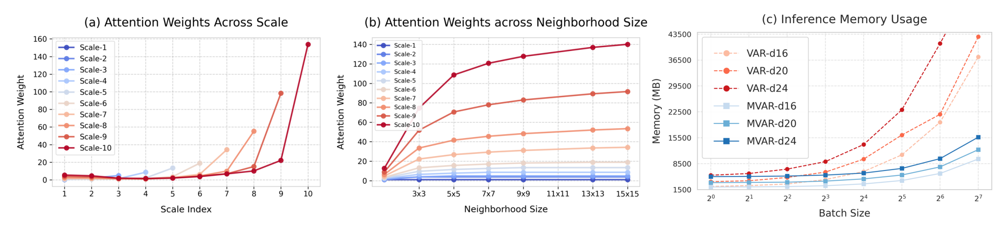
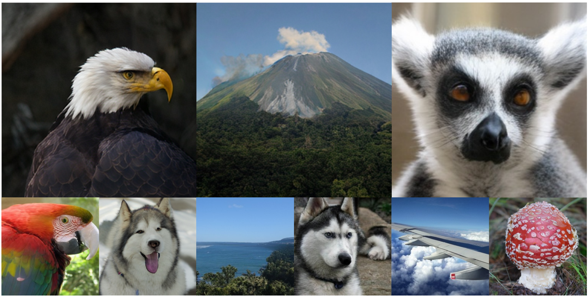
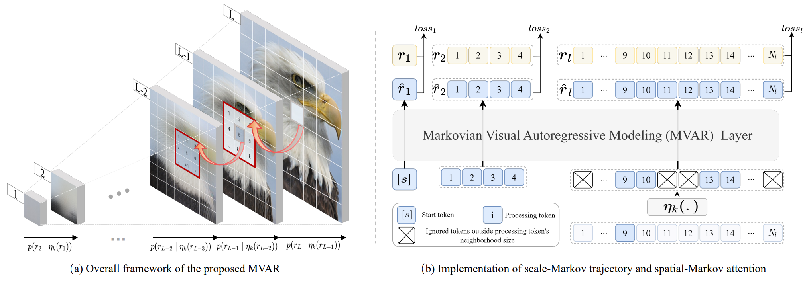
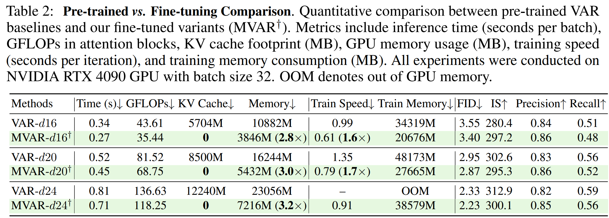
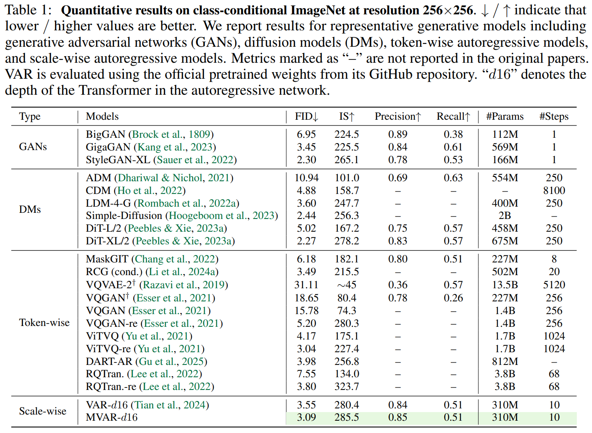
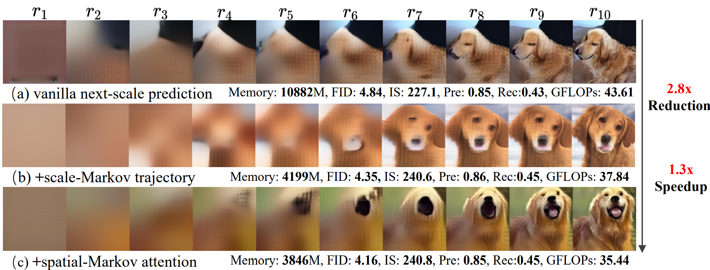

<div align="center">


# MVAR: Visual Autoregressive Modeling with Scale and Spatial Markovian Conditioning (ICLR 2026)

[Jinhua Zhang](https://scholar.google.com/citations?user=tyYxiXoAAAAJ),  [Wei Long](https://scholar.google.com/citations?user=CsVTBJoAAAAJ),  [Minghao Han](https://scholar.google.com/citations?hl=en&user=IqrXj74AAAAJ),  [Weiyi You](https://scholar.google.com/citations?user=q4uALoAAAAAJ),  [Shuhang Gu](https://scholar.google.com/citations?user=-kSTt40AAAAJ)

[](https://arxiv.org/abs/2505.12742v3)
[](https://github.com/LabShuHangGU/MVAR)
[](https://nuanbaobao.github.io/MVAR)
[](https://huggingface.co/CVLUESTC/MVAR)

</div>

⭐ If this work is helpful for you, please help star this repo. Thanks! 🤗

---

## ✨ Key Contributions

1️⃣ **Efficiency Bottleneck:** VAR exhibits scale and spatial redundancy, causing high GPU memory consumption.

<p align="center">
    
</p>

2️⃣ **Our Solution:** The proposed method enables MVAR generation **without relying on KV cache** during inference, significantly reducing the memory footprint.

<p align="center">
    
</p>

---

## 📑 Contents

- [📚 Citation](#citation)
- [📰 News](#news)
- [🛠️ Pipeline](#pipeline)
- [🥇 Results](#results)
- [🦁 Model Zoo](#model-zoo)
- [⚙️ Installation](#installation)
- [🚀 Training & Evaluation](#training--evaluation)


---
## <a name="citation"></a> 📚 Citation

Please cite our work if it is helpful for your research:

```bibtex
@article{zhang2025mvar,
  title={MVAR: Visual Autoregressive Modeling with Scale and Spatial Markovian Conditioning},
  author={Zhang, Jinhua and Long, Wei and Han, Minghao and You, Weiyi and Gu, Shuhang},
  journal={arXiv preprint arXiv:2505.12742},
  year={2025}
}
```

## <a name="news"></a> 📰 News

- **2026-02-05:** 🧠 Codebase and Weights are now available.
- **2026-01-25:** 🚀 MVAR is accepted by **ICLR 2026**.
- **2025-05-20:** 📄 Our MVAR paper has been published on [arXiv](https://arxiv.org/abs/2505.12742).

---

## <a name="pipeline"></a> 🛠️ Pipeline

MVAR introduces the **Scale and Spatial Markovian Assumption**:
- **Scale Markovian:** Only adopts the adjacent preceding scale for next-scale prediction.
- **Spatial Markovian:** Restricts the attention of each token to a localized neighborhood of size $k$ at corresponding positions on adjacent scales.

<p align="center">
    
</p>

---

## <a name="results"></a> 🥇 Results

MVAR achieves a **3.0× reduction** in GPU memory footprint compared to VAR.

<details>
<summary>📊 Comparison of Quantitative Results: MVAR vs. VAR (Click to expand)</summary>
<p align="center">
  
</p>
</details>

<details>
<summary>📈 ImageNet 256×256 Benchmark (Click to expand)</summary>
<p align="center">
  
</p>
</details>

<details>
<summary>🧪 Ablation Study on Markovian Assumptions (Click to expand)</summary>
<p align="center">
  
</p>
</details>

---

## <a name="model-zoo"></a> 🦁 MVAR Model Zoo

We provide various MVAR models accessible via our [Huggingface Repo](https://huggingface.co/CVLUESTC/MVAR).

### 📊 Model Performance & Weights

| Model | FID ↓ | IS ↑ | sFID ↓ | Prec. ↑ | Recall ↑ | Params | HF Weights 🤗 |
| :--- | :---: | :---: | :---: | :---: | :---: | :---: | :--- |
| **MVAR-d16** | 3.01 | 285.17 | 6.26 | 0.85 | 0.51 | 310M | [link](https://huggingface.co/CVLUESTC/MVAR/blob/main/mvar-d16.pth) |
| **MVAR-d16**$^{*}$ | 3.37 | 295.35 | 6.10 | 0.86 | 0.48 | 310M | [link](https://huggingface.co/CVLUESTC/MVAR/blob/main/mvar-finetune-d16.pth) |
| **MVAR-d20**$^{*}$ | 2.83 | 294.31 | 6.12 | 0.85 | 0.52 | 600M | [link](https://huggingface.co/CVLUESTC/MVAR/blob/main/mvar-finetune-d20.pth) |
| **MVAR-d24**$^{*}$ | 2.15 | 298.85 | 5.62 | 0.84 | 0.56 | 1.0B | [link](https://huggingface.co/CVLUESTC/MVAR/blob/main/mvar-finetune-d24.pth) |

> **Note:** $^{*}$ indicates models fine-tuned from VAR weights on ImageNet.

---

## <a name="installation"></a> ⚙️ Installation

1. **Create conda environment:**
   ```bash
   conda create -n mvar python=3.11 -y
   conda activate mvar
   ```

2. **Install PyTorch and dependencies:**
   ```bash
   pip install torch==2.8.0 torchvision==0.23.0 torchaudio==2.8.0 \
       xformers==0.0.32.post2 \
       --index-url https://download.pytorch.org/whl/cu128

   pip install accelerate einops tqdm huggingface_hub pytz tensorboard \
       transformers typed-argument-parser thop matplotlib seaborn wheel \
       scipy packaging ninja openxlab lmdb pillow
   ```

3. **Install [Neighborhood Attention](https://natten.org/install/):**
  
   You can also use the .whl file provided in [HuggingFace](https://huggingface.co/CVLUESTC/MVAR/blob/main/natten-0.21.1%2Btorch280cu128-cp311-cp311-linux_x86_64.whl)

   ```bash
   pip install natten-0.21.1+torch280cu128-cp311-cp311-linux_x86_64.whl
   ```

4. **Prepare [ImageNet](http://image-net.org/) dataset:**
   <details>
   <summary>Click to view expected directory structure</summary>

   ```
   /path/to/imagenet/:
       train/:
           n01440764/
           ...
       val/:
           n01440764/
           ...
   ```

   </details>


---

## <a name="training--evaluation"></a> 🚀 Training & Evaluation

### 1.Requirements (Pre-trained VAR)

Before running MVAR, you must download the necessary [VAR](https://huggingface.co/FoundationVision/var/) weight first:

You can use the `huggingface-cli` to download the entire model repository:

```bash
# Install huggingface_hub if you haven't
pip install huggingface_hub
# Download models to local directory
hf download FoundationVision/var --local-dir ./pretrained/FoundationVision/var
```

### 2.Download [MVAR](https://huggingface.co/CVLUESTC/MVAR)

```bash
# Download models to local directory
hf download CVLUESTC/MVAR --local-dir ./checkpoints
```

### 3.Flash-Attn and Xformers (Optional)

Install and compile `flash-attn` and `xformers` for faster attention computation. Our code will automatically use them if installed. See [models/basic_mvar.py#L17-L48](models/basic_mvar.py#L17-L48).


### 4.Caching VQ-VAE Latents and Code Index (Optional)

Given that our data augmentation consists of simple center cropping and random flipping, VQ-VAE latents and code indices can be pre-computed and saved to `CACHED_PATH` tto reduce computational overhead during MVAR training:

```bash
torchrun --nproc_per_node=8 --nnodes=1 --node_rank=0 main_cache.py \
  --img_size 256 --data_path ${IMAGENET_PATH} \
  --cached_path ${CACHED_PATH}/train_cache_mvar \ # or ${CACHED_PATH}/val_cache_mvar 
  --train \ # specify train
```

### 5.Training Scripts

To train MVAR on ImageNet 256x256, you can use `--use_cached=True` to use the pre-computed cached latents and code index:

```bash
# Example for MVAR-d16
torchrun --nproc_per_node=8 --nnodes=... --node_rank=... --master_addr=... --master_port=... train.py \
  --depth=16 --bs=448 --ep=300 --fp16=1 --alng=1e-3 --wpe=0.1 \
  --data_path ${IMAGENET_PATH} --exp_name ${EXP_NAME} 

# Example for MVAR-d16 (Fine-tuning)
torchrun --nproc_per_node=8 --nnodes=... --node_rank=... --master_addr=... --master_port=... train.py \
  --depth=16 --bs=448 --ep=80 --fp16=1 --alng=1e-3 --wpe=0.1 \
  --data_path ${IMAGENET_PATH} --exp_name ${EXP_NAME} --finetune_from_var=True

# Example for MVAR-d20 (Fine-tuning)
torchrun --nproc_per_node=8 --nnodes=... --node_rank=... --master_addr=... --master_port=... train.py \
  --depth=20 --bs=192 --ep=80 --fp16=1 --alng=1e-3 --wpe=0.1 \
  --data_path ${IMAGENET_PATH} --exp_name ${EXP_NAME} --finetune_from_var=True

  # Example for MVAR-d24 (Fine-tuning)
torchrun --nproc_per_node=8 --nnodes=... --node_rank=... --master_addr=... --master_port=... train.py \
  --depth=24 --bs=448 --ep=80 --fp16=1 --alng=1e-3 --wpe=0.1 \
  --data_path ${IMAGENET_PATH} --exp_name ${EXP_NAME} --finetune_from_var=True
```

### 6.Sampling & FID Evaluation

6.1. **Generate images:**
```bash
python run_mvar_evaluate.py \
  --cfg 2.7 --top_p 0.99 --top_k 1200 --depth 16 \
  --mvar_ckpt ${MVAR_CKPT}
```


*Suggested CFG for models:*
* **d16**: cfg=2.7, top_p=0.99, top_k=1200
* **d16**$^{*}$: cfg=2.0, top_p=0.99, top_k=1200
* **d20**$^{*}$: cfg=1.5, top_p=0.96, top_k=900
* **d24**$^{*}$: cfg=1.4, top_p=0.96, top_k=900


6.2. **Run evaluation:**
```bash
python utils/evaluations/c2i/evaluator.py \
  --ref_batch VIRTUAL_imagenet256_labeled.npz \
  --sample_batch ${SAMPLE_BATCH}
```

---


## 📩 Contact

If you have any questions, feel free to reach out at [jinhua.zjh@gmail.com](mailto:jinhua.zjh@gmail.com).

